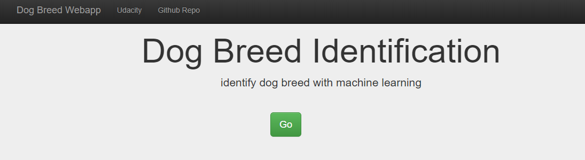
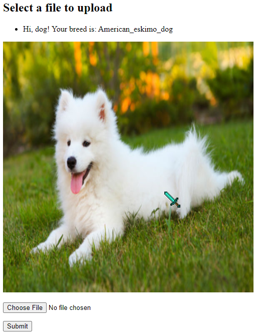

# dog-breed-app
 
---
Haoming Jin

## Project Overview

This project is part of the Capstone project for the Udacity Data Scientist Nanodegree. The goal of this project is to identify dog breed from an image. If a human is detected the code also estimates the most resembling dog breed.

The corresponding Jupyter notebook and detailed analysis is seen here:
[https://github.com/carterjin/Dog-Breed-Identification-using-Transfer-Learning/blob/master/Dog_Breed_Prediction.ipynb](https://github.com/carterjin/Dog-Breed-Identification-using-Transfer-Learning/blob/master/Dog_Breed_Prediction.ipynb)

## Tools used:
- Python 3.7
- flask 1.1.1
- werkzeug 1.0.0
- keras 2.4.3
- tensorflow 2.3.0
- openCV 4.3.0
- numpy

## Installation/Usage
1. Clone/download this repo.
2. Install the required tools or packages, as seen above.
3. Run with Python in the app directory: ```python run.py```
4. Open browser and enter ```127.0.0.1:3001```


5. Click 'go' and then click choose file to select your image and then click 'Submit'.



## Files in this Repo

app
    haarcascades
		haarcascade_frontalface_alt.xml: Used for face detection in human detector
	static/uploads: A folder to save the uploaded image
	templates
	    master.html: A welcome page with title and contact info etc.
		upload.html: The page where you upload the image and dog breed is predicted.
	dog_breed_predict.py: Contains the algorithm to predict dog breeds, which is imported by run.py
	resnet50_dog_predict_model: The model with pretrained weights which is loaded by dog_breed_predict.py
	run.py: Runs the Flask app.